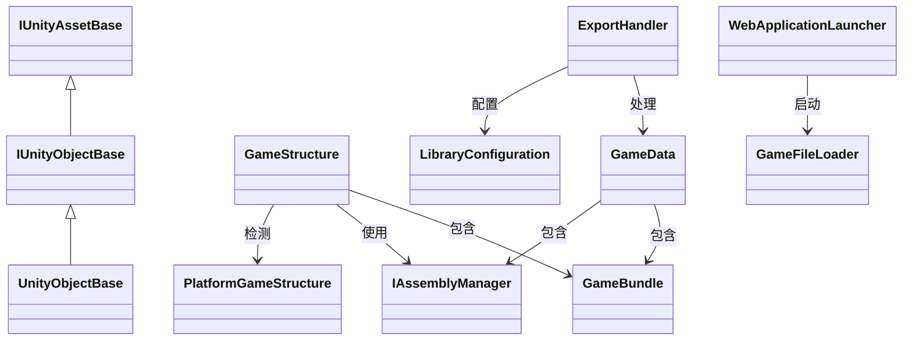

# AssetRipper 核心类详细说明

## IUnityObjectBase 接口

### 概述
`IUnityObjectBase` 是 AssetRipper 中所有 Unity 对象的基础接口，继承自 `IUnityAssetBase`。它定义了 Unity 对象的核心属性和行为。

### 命名空间
```csharp
AssetRipper.Assets
```

### 主要属性

#### AssetInfo
```csharp
AssetInfo AssetInfo { get; }
```
资产的关键位置信息。

#### ClassID
```csharp
int ClassID { get; }
```
对象的原生类 ID 编号。

#### ClassName
```csharp
string ClassName { get; }
```
对象的原生类名。

#### Collection
```csharp
AssetCollection Collection { get; }
```
此对象所属的资产集合。

#### PathID
```csharp
long PathID { get; }
```
此对象在集合中的路径 ID。

#### OriginalPath
```csharp
string? OriginalPath { get; set; }
```
对象的原始路径（如果已知）。

#### MainAsset
```csharp
IUnityObjectBase? MainAsset { get; set; }
```
与此对象关联的主要资产（如果存在）。

### 主要方法

#### GetBestDirectory
```csharp
string GetBestDirectory()
```
获取对象的最佳目录路径，优先级顺序：
1. OverrideDirectory
2. OriginalDirectory
3. ClassName

#### GetBestName
```csharp
string GetBestName()
```
获取对象的最佳名称，优先级顺序：
1. OverrideName
2. IHasNameString.NameString
3. OriginalName
4. ClassName

#### GetBestExtension
```csharp
string? GetBestExtension()
```
获取对象的最佳扩展名，优先级顺序：
1. OverrideExtension
2. OriginalExtension

#### CopyValues
```csharp
void CopyValues(IUnityObjectBase? source)
```
从源对象复制值到当前对象。

## GameStructure 类

### 概述
`GameStructure` 类负责表示和处理游戏的整体结构，包括文件收集、平台检测和程序集管理。

### 命名空间
```csharp
AssetRipper.Import.Structure
```

### 主要属性

#### FileCollection
```csharp
public GameBundle FileCollection { get; private set; }
```
游戏的文件集合。

#### PlatformStructure
```csharp
public PlatformGameStructure? PlatformStructure { get; private set; }
```
平台特定的游戏结构。

#### AssemblyManager
```csharp
public IAssemblyManager AssemblyManager { get; set; }
```
程序集管理器。

### 主要方法

#### Load
```csharp
public static GameStructure Load(IEnumerable<string> paths, CoreConfiguration configuration)
```
从指定路径加载游戏结构。

#### IsValid
```csharp
public bool IsValid => FileCollection.HasAnyAssetCollections();
```
检查游戏结构是否有效。

## ExportHandler 类

### 概述
`ExportHandler` 类负责处理资产的导出流程，包括加载、处理和导出三个阶段。

### 命名空间
```csharp
AssetRipper.Export.UnityProjects
```

### 主要属性

#### Settings
```csharp
protected LibraryConfiguration Settings { get; }
```
库配置设置。

### 主要方法

#### Load
```csharp
public GameData Load(IReadOnlyList<string> paths)
```
从指定路径加载游戏数据。

#### Process
```csharp
public void Process(GameData gameData)
```
处理游戏数据。

#### Export
```csharp
public void Export(GameData gameData, string outputPath)
```
将游戏数据导出到指定路径。

#### LoadAndProcess
```csharp
public GameData LoadAndProcess(IReadOnlyList<string> paths)
```
加载并处理游戏数据。

## GameData 类

### 概述
`GameData` 是一个记录类，包含游戏的所有核心数据，用于在处理流程中传递。

### 命名空间
```csharp
AssetRipper.Processing
```

### 主要属性

#### GameBundle
```csharp
GameBundle GameBundle
```
游戏的资产包集合。

#### ProjectVersion
```csharp
UnityVersion ProjectVersion
```
项目版本。

#### AssemblyManager
```csharp
IAssemblyManager AssemblyManager
```
程序集管理器。

#### PlatformStructure
```csharp
PlatformGameStructure? PlatformStructure
```
平台结构。

### 主要方法

#### AddNewProcessedCollection
```csharp
public ProcessedAssetCollection AddNewProcessedCollection(string name)
```
添加新的处理后资产集合。

#### FromGameStructure
```csharp
public static GameData FromGameStructure(GameStructure gameStructure)
```
从 GameStructure 创建 GameData 实例。

## FileSystem 类

### 概述
`FileSystem` 类提供文件系统相关的实用方法，处理文件名验证、冲突解决等。

### 命名空间
```csharp
AssetRipper.IO.Files
```

### 主要常量

#### MaxFileNameLength
```csharp
public const int MaxFileNameLength = ActualMaxFileNameLength - ReservedCharacterCount;
```
最大文件名长度。

### 主要方法

#### GetUniqueName
```csharp
public static string GetUniqueName(string dirPath, string fileName, int maxNameLength)
```
获取唯一的文件名，解决文件名冲突。

#### FixInvalidFileNameCharacters
```csharp
public static string FixInvalidFileNameCharacters(string path)
```
修复无效的文件名字符。

#### FixInvalidPathCharacters
```csharp
public static string FixInvalidPathCharacters(string path)
```
修复无效的路径字符。

## WebApplicationLauncher 类

### 概述
`WebApplicationLauncher` 类负责启动 Web 应用程序，配置路由和服务。

### 命名空间
```csharp
AssetRipper.GUI.Web
```

### 主要方法

#### Launch
```csharp
public static void Launch(string[] args)
public static void Launch(int port = Defaults.Port, bool launchBrowser = Defaults.LaunchBrowser, bool log = Defaults.Log, string? logPath = Defaults.LogPath)
```
启动 Web 应用程序。

## 类关系图



## 使用示例

### 加载和处理游戏数据
```csharp
// 创建配置
LibraryConfiguration settings = new();

// 创建导出处理器
ExportHandler exportHandler = new(settings);

// 加载和处理数据
GameData gameData = exportHandler.LoadAndProcess(paths);

// 导出数据
exportHandler.Export(gameData, outputPath);
```

### 创建自定义资产处理器
```csharp
public class CustomAssetProcessor : IAssetProcessor
{
    public void Process(GameData gameData)
    {
        // 自定义处理逻辑
        foreach (IUnityObjectBase asset in gameData.GameBundle.FetchAssets())
        {
            // 处理特定类型的资产
        }
    }
}
```